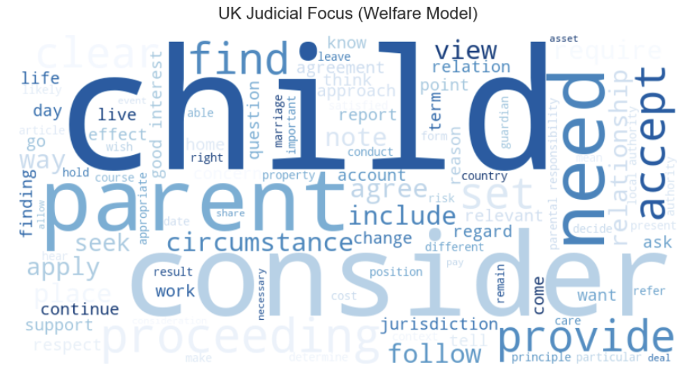

# ⚖️ Computational Legal Studies: Quantifying the "Gap of Justice"
### A Comparative Analysis of Matrimonial Property Division (UK vs. China)


> **Project Status:** 🟢 Active (Capstone Extension)  
> **Domain:** Computational Social Science, Family Law, NLP  
> **Tech Stack:** Python, spaCy, Pandas, SciPy, Matplotlib, WordCloud, Regex


## 📖 Project Background
This repository serves as the **computational extension** of my Master's thesis: *"The Impact of Chinese and British Marital Property Division Mechanism on Chinese Women's Post-divorce Economic Security"*.


While my thesis used **Grounded Theory** to qualitatively diagnose the "Formal Equality Trap" in Chinese divorce settlements, this project aims to **quantitatively verify** these findings using Natural Language Processing (NLP). By analyzing 166 judicial documents from Shanghai and the UK, I aim to visualize and statistically test the divergence between the UK's *"Needs-Based"* dynamic fairness and China's *"Property-Focused"* formal equality.


## 📊 Key Findings (Notebook 01)


### Visual Analysis: Word Cloud Comparison
The linguistic landscape of judgments reveals a systemic difference in judicial focus:


| **UK Judgments: "Human-Centric"** | **China Judgments: "Asset-Centric"** |
|:---------------------------------:|:-----------------------------------:|
|  |  |
| Dominance of **"Child"**, **"Needs"**, **"Care"**. Reflects the *Welfare Principle* and *Dynamic Fairness*. | Dominance of **"Property" (财产)**, **"Payment" (支付)**. Reflects the *Formal Equality Trap* and transactional focus. |


### Statistical Analysis: Hypothesis Testing
These visual patterns are **statistically significant**:


| Test | UK Mean | CN Mean | P-value | Effect Size |
|------|---------|---------|---------|-------------|
| Needs-Based Reasoning | 3.12 | 0.45 | <0.0001*** | 1.15 (Large) |
| Property Focus | 1.59 | 6.31 | <0.0001*** | 0.70 (Medium) |


> **Conclusion:** UK courts mention "needs" 7x more frequently than Chinese courts (p < 0.0001). This empirically confirms the "Formal Equality Trap" hypothesis.


## 📂 Portfolio Roadmap
This portfolio demonstrates a progressive pipeline from raw legal text to policy insight.


- [x] **01. Legal Text Mining & Visualization** ([View Notebook](notebooks/01_legal_text_processing.ipynb))
    - **Objective:** Build an ETL pipeline for heterogeneous legal data (HTML/PDF), extract features, and perform comparative analysis.
    - **Tech Highlights:**
        - **Ethical Scraper:** BAILII data collection with rate limiting.
        - **Dual-Language NLP:** Custom pipelines for English and Chinese texts.

## 🛠️ Installation & Reproduction

1. **Clone the repository**:
   ```bash
   git clone https://github.com/Skye-SU/Computational-Legal-Studies-Portfolio.git
   cd Computational-Legal-Studies-Portfolio
   ```

2. **Install dependencies**:
   ```bash
   pip install -r requirements.txt
   python -m spacy download en_core_web_sm
   python -m spacy download zh_core_web_sm
   ```

3. **Run the notebook**:
   ```bash
   jupyter notebook notebooks/01_legal_text_processing.ipynb
   ```

> **Note:** Step 1 (Data Collection) downloads ~50 UK judgments from BAILII with ethical rate limiting (~5-10 min). China judgment PDFs are **not included** in this repository due to data licensing restrictions — place your own PDFs in `data/china_judgments/` to run the full pipeline, or the notebook will automatically proceed with UK-only analysis.

## 👩‍💻 About the Author
**Skye SU**  
*Master of Social Policy, Lingnan University*  
Interested in Legal Tech, Data-Driven Policy, and Gender Equality.
